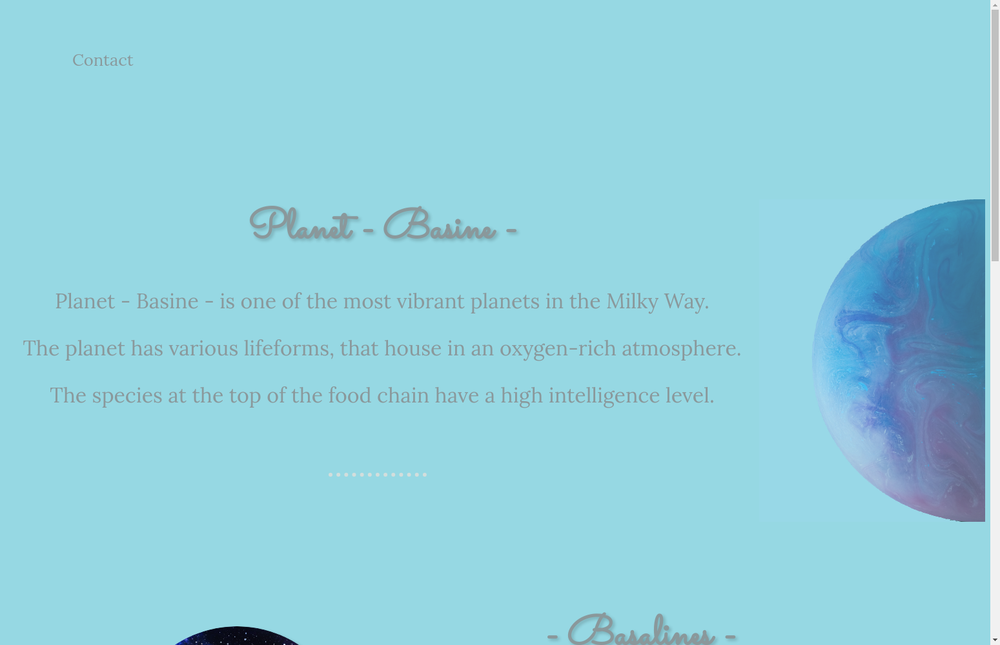

# Basine

🌐 **Live Site**: [Visit Planet Basine](https://raimonvibe.github.io/Basine/)

## About

Planet Basine is a fictional planet website showcasing one of the most vibrant planets in the Milky Way. The site features information about:

- The planet's oxygen-rich atmosphere and various lifeforms
- The Basalines species at the top of the food chain
- Interactive elements and contact information

## Technologies

- HTML5
- CSS3
- Custom web design

## Credits

- Planet photo by Solen Feyissa on Unsplash
- Created by Raimon © 2022
